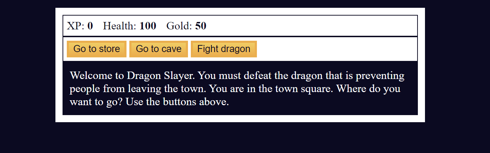
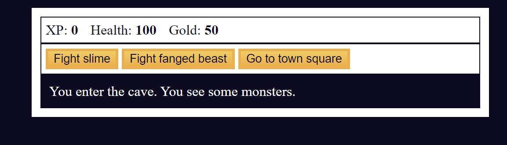
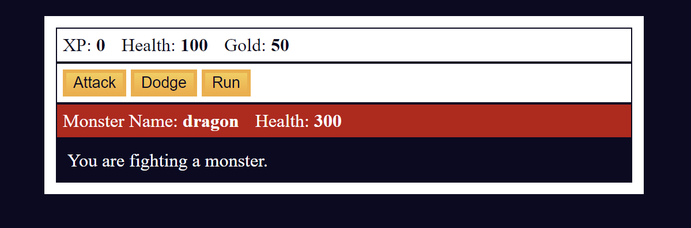

Recreated web game using html+css+js.

Basically, you have:

3 buttons, which alows you to move to different locations.
locations are: 
-store;
-cave;
-dragon cave;

actions:

-buy weapon;
-buy health;
-sell weapon;

-attack;
-dodge attack;
-return to town;

also, there is one mini-game, which is left as an easter egg.

Applied many functions and relearned more about js.
Took 6-7 hours, but it was worth it. 